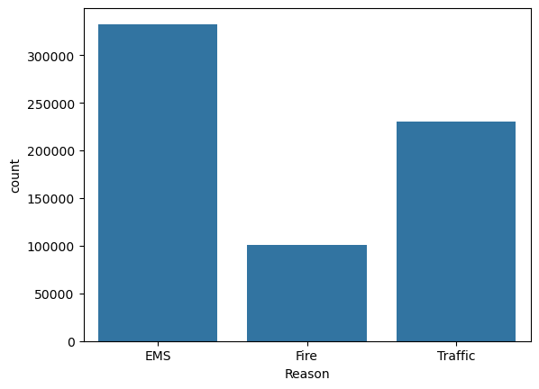
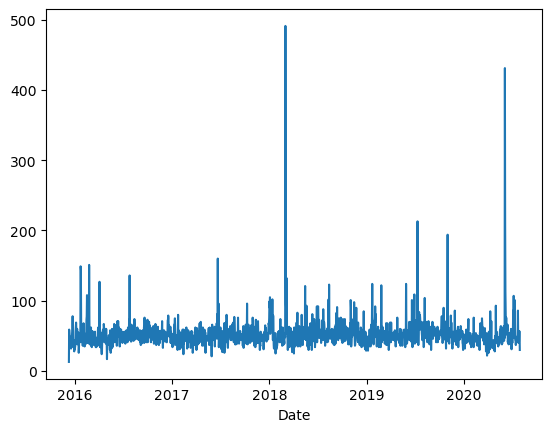
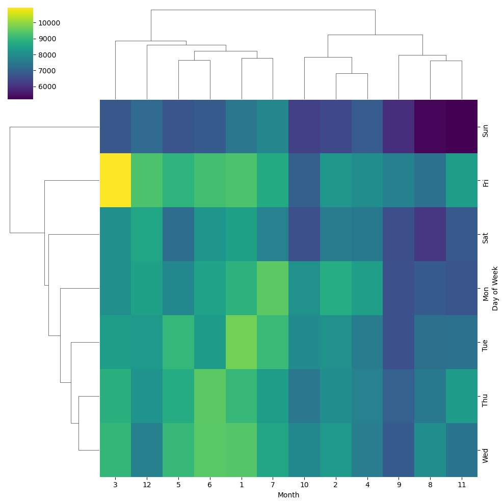

# 📞 Call Center Data Analysis Dashboard
### Data Analysis Project using Python | Pandas | Matplotlib | Seaborn
<p align="center">

</p>

## 📌 Project Overview

This project analyzes over 90,000 emergency call records to discover customer behavior, peak hours, response trends, and operational insights.

The analysis was performed using Python libraries such as Pandas, NumPy, Matplotlib, and Seaborn inside Jupyter Notebook.
## 📂 Dataset

Source: Kaggle 911 Emergency Calls Dataset

Features include:

- Call Type
- Timestamp
- Township
- Zip Code
- Latitude & Longitude
- Emergency Reason
 ## 🛠️ Technologies


- Pandas
- NumPy
- Matplotlib
- Seaborn
- Jupyter Notebook
 ## 📁 Project Structure

```text
Call-Center-Project
│
├── data
│   └── 911.csv
│
├── notebook
│   └── Call_Center.ipynb
│
├── images
│   ├── dashboard.png
│   ├── countplot.png
│   ├── monthly_calls.png
│   ├── heatmap.png
│   └── clustermap.png
│
└── README.md
```
## 📈 Key Insights

✔ EMS calls represent the largest category.

✔ Most calls occur during weekdays.

✔ Call volume peaks during daytime.

✔ Seasonal trends can be observed throughout the year.

✔ Heatmap analysis reveals monthly activity patterns.
## 📊 Visualizations
### Emergency Calls by Reason

<p align="center">
  
</p>

<p align="center">
  
</p>

 <p align="center">
  
</p>

## ✅ Conclusion

This project demonstrates exploratory data analysis techniques using Python to uncover meaningful patterns from emergency call records.

The workflow includes:

- Data Cleaning
- Feature Engineering
- Visualization
- Trend Analysis
- Business Insights
## 👩‍💻 Author

**Nargiz Alimammadzada**
